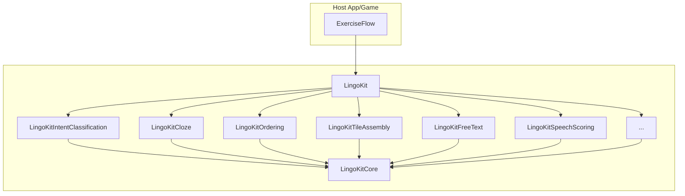

# LingoKit
A plug-and-play, UI-agnostic Swift toolkit for building and scoring language-learning exercises. 📚

It supports activities across *reading*, *writing*, *listening*, and *speaking* by providing reusable exercise modules and consistent evaluation/scoring logic.

Instead of organizing by modality, `LingoKit` organizes by exercise type—such as `intent classification`, `cloze`, or `ordering`—allowing the same exercise to be reused across different contexts. For example, `intent classification` can work with written prompts (*reading*) or audio transcripts (*listening*).

This approach keeps UI and content flexible while making it easy to integrate well-defined challenges and receive consistent, comparable results.

