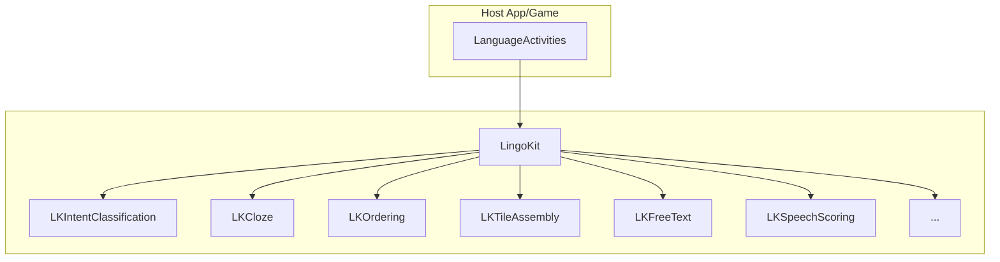

<p align="center">
  <a href="https://developer.apple.com/swift/"></a>
  <a href="https://developer.apple.com/xcode/"></a>
  <a href="https://en.wikipedia.org/wiki/List_of_Apple_operating_systems"></a>
  <a href="https://developer.apple.com/documentation/xcode/swift-packages"></a>
  <a href="https://thatfactory.github.io/lingokit/documentation/lingokit/"></a>
  <a href="https://en.wikipedia.org/wiki/MIT_License"></a>
  <a href="https://github.com/thatfactory/lingokit/actions/workflows/ci.yml"></a>
  <a href="https://github.com/thatfactory/lingokit/actions/workflows/release.yml"></a>
</p>

# LingoKit
A plug-and-play, UI-agnostic Swift toolkit for building and scoring language-learning exercises. 📚

It supports activities across *reading*, *writing*, *listening*, and *speaking* by providing reusable exercise modules and consistent evaluation/scoring logic.

Instead of organizing by modality, `LingoKit` organizes by exercise type—such as `intent classification`, `cloze`, or `ordering`—allowing the same exercise to be reused across different contexts. For example, `intent classification` can work with written prompts (*reading*) or audio transcripts (*listening*).

This approach keeps UI and content flexible while making it easy to integrate well-defined challenges and receive consistent, comparable results.

Each exercise engine can expose an `LKExerciseType` taxonomy value so host apps can model generic flows while keeping evaluation logic in `LingoKit`.

## Implemented Exercise Engines

- `Intent classification` (`LKIntentClassificationExercise`): classify a prompt into one expected intent with deterministic scoring.
- `Tile assembly` (`LKTileAssemblyExercise`): assemble constrained tiles into an exact expected sequence for writing construction.

## Structure


```mermaid
flowchart TB
  subgraph HOST["Host App/Game"]
    ACTIVITIES["LanguageActivities"]
  end

  subgraph LK[" "]
    ALL["LingoKit"]

    IC["LKIntentClassification"]
    CLOZE["LKCloze"]
    ORDER["LKOrdering"]
    TILES["LKTileAssembly"]
    FTXT["LKFreeText"]
    SPEECH["LKSpeechScoring"]
    ETC["..."]
  end

  ACTIVITIES --> ALL

  ALL --> IC
  ALL --> CLOZE
  ALL --> ORDER
  ALL --> TILES
  ALL --> FTXT
  ALL --> SPEECH
  ALL --> ETC
```
## Integration
### Xcode
Use Xcode's [built-in support for SPM](https://developer.apple.com/documentation/xcode/adding_package_dependencies_to_your_app).

*or...*

### Package.swift
In your `Package.swift`, add `LingoKit` as a dependency:
```swift
dependencies: [
    .package(
        url: "https://github.com/thatfactory/lingokit",
        from: "0.6.1"
    )
]
```

Associate the dependency with your target:
```swift
targets: [
    .target(
        name: "YourTarget",
        dependencies: [
            .product(
                name: "LingoKit",
                package: "lingokit"
            )
        ]
    )
]
```

Run: `swift build`
